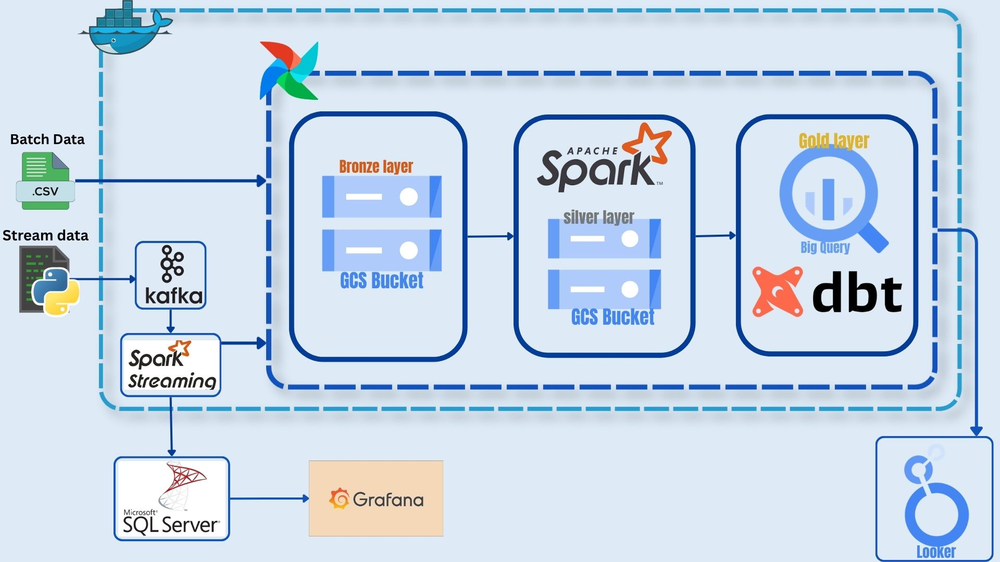
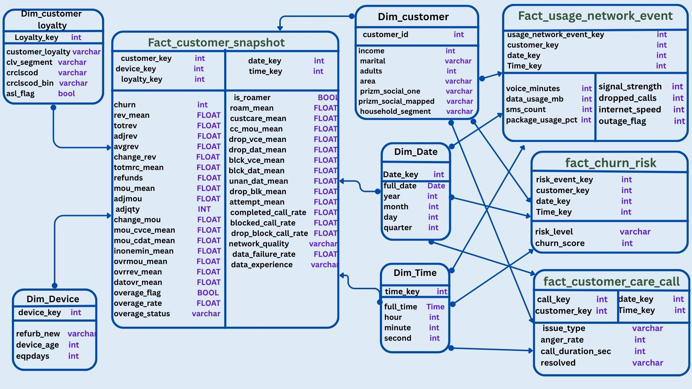
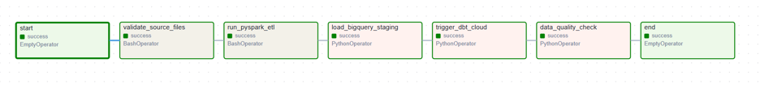

# 🚀 TelecoVision – Telecom Churn Analytics Platform

## 📌 Overview

TelecoVision is an end-to-end Telecom Data Engineering Platform that combines both **Batch** and **Streaming** data processing to provide real-time customer monitoring, churn prediction, customer experience analytics, and business intelligence reporting.

The platform integrates telecom data from multiple operational systems and transforms it into actionable insights through a scalable modern data architecture.

---

# 🎯 Business Problem

Telecom companies lose a significant percentage of customers every year due to churn.

### Challenges

🔹 Customer data is scattered across multiple systems such as:

* CRM Systems
* Billing Systems
* Network Monitoring Systems
* Customer Service Systems

🔹 No real-time visibility into customer behavior and network events.

🔹 Lack of a centralized analytical layer for business reporting.

🔹 Difficulty identifying customers who are likely to churn before they leave.

### Solution

TelecoVision unifies both streaming and batch data into a single platform, enabling:

✅ Real-Time Churn Monitoring

✅ Customer Analytics

✅ Usage Analytics

✅ Customer Experience Analytics

✅ Revenue Impact Analysis

✅ Interactive Dashboards

---

# 🏗️ Solution Architecture

## Complete Platform Architecture

The platform combines both Batch and Streaming pipelines using a Medallion Architecture to support operational monitoring and analytical workloads.

---

## Real-Time Streaming Pipeline

The streaming layer captures telecom events from Kafka topics and processes them using Spark Structured Streaming for real-time analytics and churn prediction.

---

# 🛠️ Technology Stack

## ⚡ Streaming Layer

* Apache Kafka
* Apache Spark Structured Streaming
* Microsoft SQL Server
* Google Cloud Storage (GCS)

## 📦 Batch Layer

* Apache Spark
* Google Cloud Storage (GCS)
* BigQuery
* dbt Cloud

## 🎼 Orchestration

* Apache Airflow

## 📊 Visualization

* Grafana
* Looker Studio

---

# 🥉🥈🥇 Medallion Architecture

## 🥉 Bronze Layer

Stores raw streaming and batch data exactly as received from source systems.

### Storage

* Raw JSON Files
* Raw Telecom Events
* Google Cloud Storage

---

## 🥈 Silver Layer

Processes raw data and applies business transformations.

### Transformations

✅ Data Cleaning

✅ Data Validation

✅ Standardization

✅ Mapping

✅ Feature Engineering

✅ Data Enrichment

### Storage

* Parquet Files
* Google Cloud Storage

---

## 🥇 Gold Layer

Business-ready analytical layer optimized for reporting and dashboarding.

### Storage

* BigQuery
* Data Warehouse Tables

---

# 🌌 Data Warehouse Design

## Galaxy Schema

The warehouse follows **Kimball Dimensional Modeling** principles and implements a **Fact Constellation (Galaxy Schema)**.

---

## 📈 Fact Tables

### Fact Customer Snapshot

**Type:** Periodic Snapshot Fact

**Grain:** Customer + Date + Time Snapshot

Contains:

* Churn Score
* Risk Level
* Customer Metrics
* Network Metrics
* Usage Metrics

---

### Fact Customer Care Call

**Type:** Transaction Fact

**Grain:** One Customer Care Call

Contains:

* Call Duration
* Anger Rate
* Resolution Status
* Issue Type

---

### Fact Usage Network Event

**Type:** Transaction Fact

**Grain:** One Usage or Network Event

Contains:

* Internet Usage
* Voice Minutes
* SMS Usage
* Network Performance Metrics

---

### Fact Churn Risk

**Type:** Transaction Fact

**Grain:** One Churn Scoring Event

Contains:

* Churn Probability
* Risk Category
* Churn Indicators

---

## 📚 Dimension Tables

### Conformed Dimensions

* Dim Customer
* Dim Date
* Dim Time

### Standard Dimensions

* Dim Device
* Dim Customer Loyalty

---

# ⚡ Streaming Pipeline

## Apache Kafka

Telecom events are continuously generated and streamed into Kafka.

### Topics

### Customer Care Calls

* 2 Partitions

Contains:

* Call Duration
* Anger Rate
* Issue Type
* Resolution Status

### Network Events

* 2 Partitions

Contains:

* Signal Strength
* Internet Speed
* Drop Calls
* Network State

### Usage Events

* 3 Partitions

Contains:

* Internet Usage
* Voice Minutes
* SMS Count

---

### Kafka Cluster

* 3 Brokers
* Replication Factor = 2

### Benefits

✅ Scalability

✅ Parallel Processing

✅ High Availability

✅ Fault Tolerance

If a broker becomes unavailable, Kafka automatically switches to a replica and continues processing without interruption.

---

## Spark Structured Streaming

Spark consumes telecom events from Kafka and processes them using micro-batches.

### Streaming Operations

✅ Read Events from Kafka

✅ Store Raw Data in SQL Server

✅ Store Raw Data in Bronze Layer

✅ Join Multiple Streams

✅ Calculate Churn Scores

✅ Generate Risk Levels

✅ Write Results to SQL Server

✅ Write Results to GCS

This enables near real-time churn monitoring and customer analytics.

---

# 📦 Batch Pipeline

## Raw Data Ingestion

Historical telecom datasets are uploaded to the Bronze Layer in Google Cloud Storage.

---

## Apache Spark Processing

Spark processes data across multiple worker nodes.

### Transformations

✅ Cleaning

✅ Mapping

✅ Standardization

✅ Feature Engineering

✅ Data Enrichment

### Output

Processed data is stored in the Silver Layer as optimized Parquet files.

---

## BigQuery + dbt

Silver Layer data is loaded into BigQuery and transformed using dbt.

### dbt Responsibilities

✅ Data Modeling

✅ Fact Table Creation

✅ Dimension Table Creation

✅ Business Logic Implementation

✅ Data Warehouse Construction

---

# 🎼 Airflow Orchestration

Apache Airflow orchestrates the entire platform.

### Responsibilities

* Scheduling Pipelines
* Managing Dependencies
* Executing Spark Jobs
* Triggering dbt Runs
* Monitoring Workflow Execution
* Failure Recovery

---

# 📊 Grafana Dashboards

Grafana provides real-time operational monitoring over streaming telecom events.

---

## Churn Dashboard

### Insights

* Real-Time Churn Monitoring
* Churn Score Tracking
* Risk Distribution
* High-Risk Customer Detection

---

## Customer Service & Quality Dashboard

### Insights

* Customer Service Monitoring
* Resolution Performance
* Anger Rate Tracking
* Quality Indicators

---

## Telecom Network Dashboard

### Insights

* Network Quality Monitoring
* Signal Strength Analytics
* Internet Performance
* Drop Call Monitoring

---

# 📈 Looker Studio Dashboards

Looker Studio provides business-level analytics built on top of the Data Warehouse.

---

## Customer Overview Dashboard

### Insights

* Customer Segmentation
* Loyalty Analytics
* Customer Distribution
* Behavioral Analysis

---

## Churn Risk Dashboard

### Insights

* Churn Distribution
* Risk Categories
* Churn Drivers
* Retention Opportunities

---

## Revenue Impact Dashboard

### Insights

* Revenue at Risk
* Churn Cost Analysis
* Revenue Trends
* Customer Value Analysis

---

## Network Experience & Quality Dashboard

### Insights

* Network Performance Analytics
* Customer Experience Metrics
* Data Failure Analysis
* Quality Distribution

---

# 🌟 Key Features

✅ Batch + Streaming Integration

✅ Real-Time Churn Monitoring

✅ Customer Analytics

✅ Usage Analytics

✅ Customer Experience Analytics

✅ Revenue Impact Analysis

✅ Enterprise Data Warehouse

✅ Automated Data Pipelines

✅ Interactive Dashboards

---

# 👩‍💻 Team

### ITI Data Engineering Graduation Project

* Reham Mohammed
* Sara Abuzeid
* Yasmin Shamakh
* Nermeen saad

⭐ If you found this project interesting, don't forget to give it a Star.
