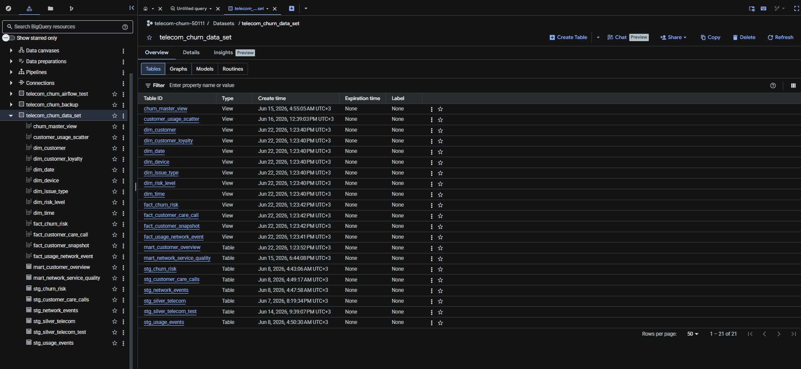
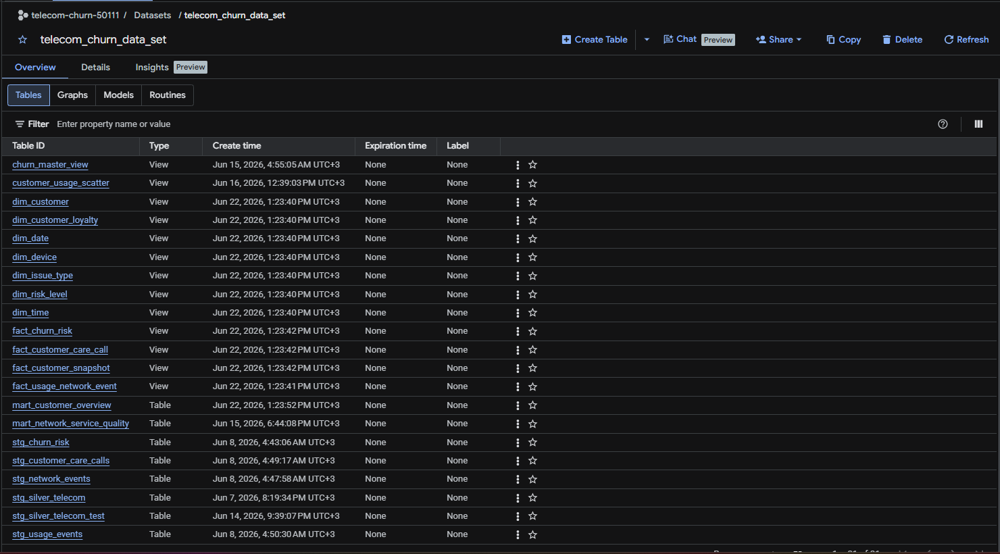
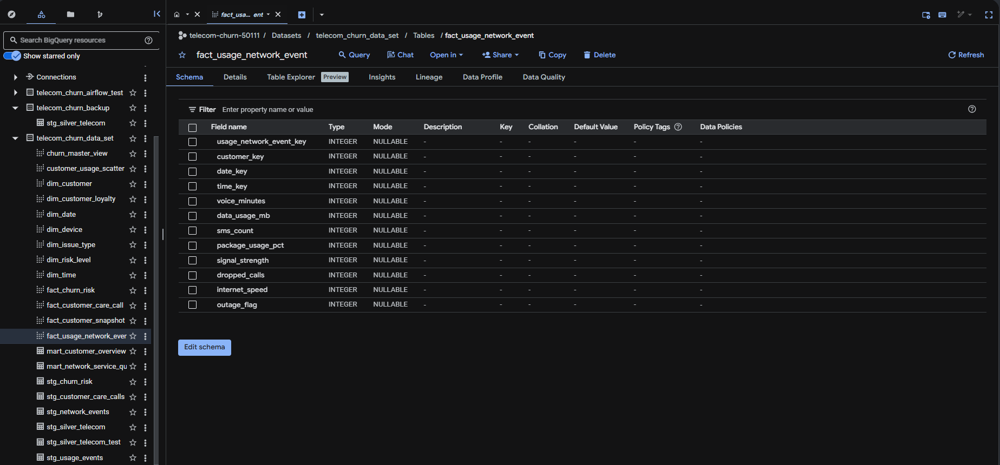

# BigQuery Data Warehouse Structure

This folder documents the BigQuery layer of the Telecom Churn project.

---

## 🧱 Dataset Overview

The project uses a structured Data Warehouse inside BigQuery:

- Dataset Name: telecom_churn_data
- Contains:
  - Dimension tables (dim_*)
  - Fact tables (fact_*)
  - Staging tables (stg_*)
  - Views for analytics

---

## 📊 Architecture Style

We follow a layered architecture:

Raw Data → Staging (stg_) → Dimension/Fact → Views → Dashboards

---

## 📂 Main Tables

### Dimension Tables
- dim_customer
- dim_device
- dim_time
- dim_issue_type
- dim_risk_level

### Fact Tables
- fact_usage_events
- fact_customer_care
- fact_network_events

### Views
- churn_master_view
- customer_usage_scatter
- mart_customer_overview

---

## 📸 Screenshots

### 1. BigQuery Overview

### 2. Dataset Tables

### 3. Table Schema Example

---

## 📌 Notes

- Staging tables (stg_) are intermediate cleaned data.
- Fact tables store events and metrics.
- Dimension tables describe entities.
- Views are used for BI dashboards (Grafana / Looker / Power BI).
